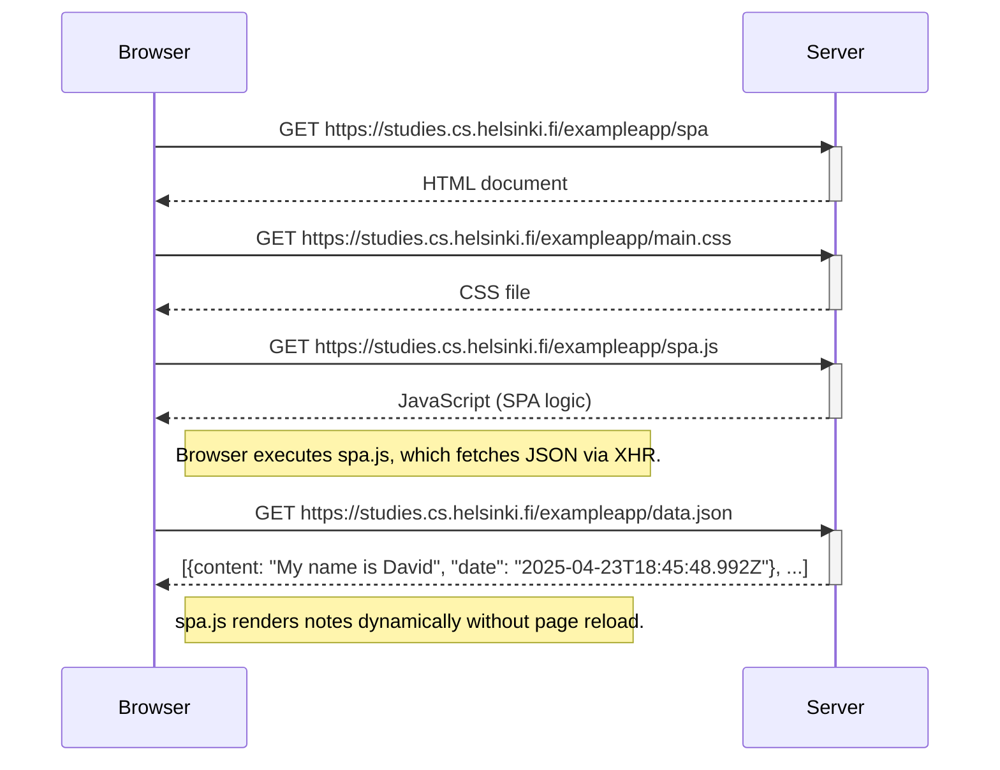

0.5: Single page app diagram

```mermaid
sequenceDiagram
    participant Browser
    participant Server

    Browser->>Server: GET https://studies.cs.helsinki.fi/exampleapp/spa
    activate Server
    Server-->>Browser: HTML document
    deactivate Server

    Browser->>Server: GET https://studies.cs.helsinki.fi/exampleapp/main.css
    activate Server
    Server-->>Browser: CSS file
    deactivate Server

    Browser->>Server: GET https://studies.cs.helsinki.fi/exampleapp/spa.js
    activate Server
    Server-->>Browser: JavaScript (SPA logic)
    deactivate Server

    Note right of Browser: Browser executes spa.js, which fetches JSON via XHR.

    Browser->>Server: GET https://studies.cs.helsinki.fi/exampleapp/data.json
    activate Server
    Server-->>Browser: [{content: "My name is David", "date": "2025-04-23T18:45:48.992Z"}, ...]
    deactivate Server

    Note right of Browser: spa.js renders notes dynamically without page reload.
```